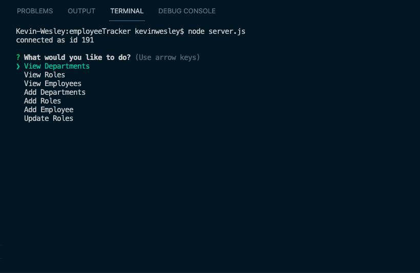
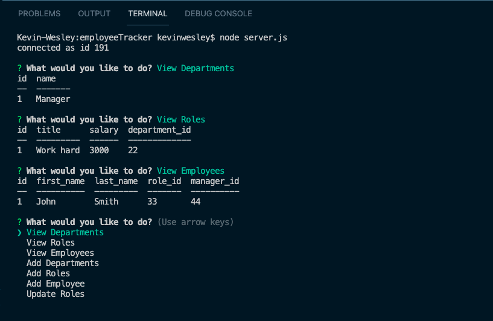
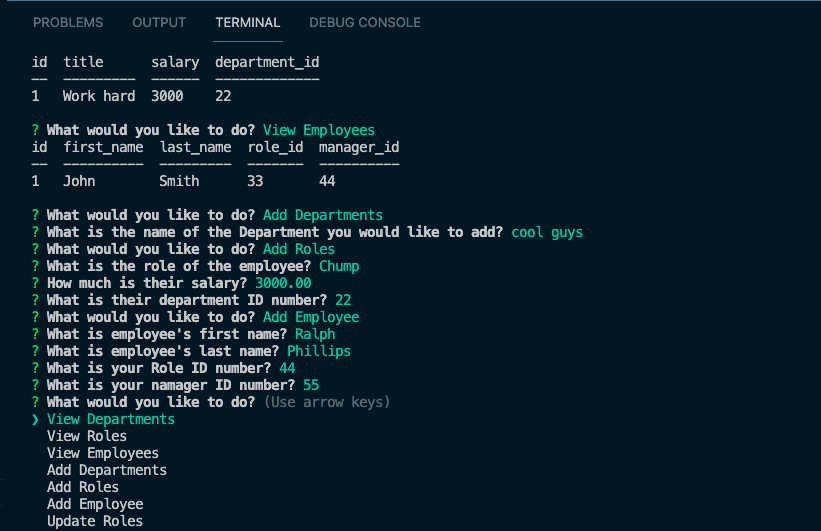

# employeeTracker

## Description
- Using command line prompts, we can view, add and update employees, departments and roles that are recorded and retrieved from an SQL database
- The project was built to easily add, view and update employees roles
- Learned more about back end devolopment using mySQL and Inquirer.

## Usage
When you start the server, the CLI starts and prompts you with what you would like to do    

 
You can view by Department, Role, and Employee  

You can add by Department, Role or Employee

## License
ISC
